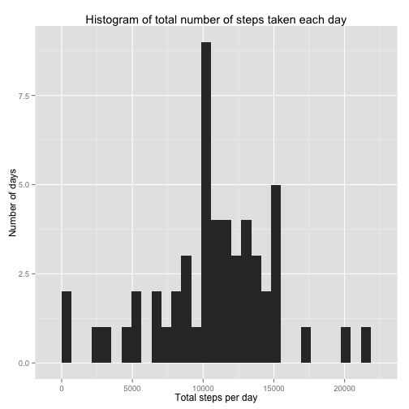
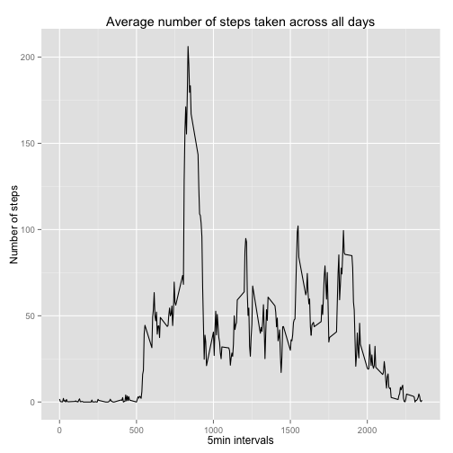
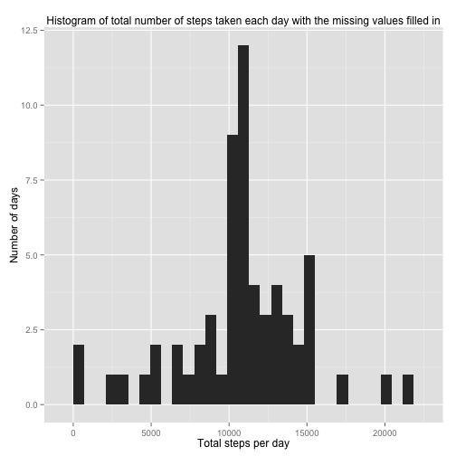
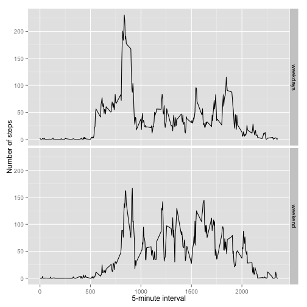

##Loading and processing data

1. Fork/clone the GitHub repository created for this assignment : https://github.com/rdpeng/RepData_PeerAssessment1
2. Clone it into your working directory : git clone (your forked directory url)
3. Don't forget to set your own working directory in this code if you want to use it. 
4. You will need the following packages to run this code </br>
- data.table
- datasets
- ggplot2
- timeDate </br>


```r
#Change working directory
setwd("/Users/augustinjossa/Desktop/MOOC/Programming_assignment/Reproducible/P1/RepData_PeerAssessment1")

#Load the data
unzip("activity.zip", overwrite = TRUE)
activity<- read.csv("activity.csv", sep=",", header = TRUE, na.strings = "NA")

#Process the data
library(data.table)
```

```
## data.table 1.9.4  For help type: ?data.table
## *** NB: by=.EACHI is now explicit. See README to restore previous behaviour.
```

```r
library(datasets)
library(ggplot2)
library(timeDate)
activity$steps<- as.numeric(activity$steps)
activity$date<- as.Date(activity$date)
```


##What is the mean total number of steps taken per day?

1. Calculate the total number of steps taken per day

```r
steps_sum<- aggregate(steps ~ date, data = activity, sum, na.rm = TRUE)
print(steps_sum)
```

```
##          date steps
## 1  2012-10-02   126
## 2  2012-10-03 11352
## 3  2012-10-04 12116
## 4  2012-10-05 13294
## 5  2012-10-06 15420
## 6  2012-10-07 11015
## 7  2012-10-09 12811
## 8  2012-10-10  9900
## 9  2012-10-11 10304
## 10 2012-10-12 17382
## 11 2012-10-13 12426
## 12 2012-10-14 15098
## 13 2012-10-15 10139
## 14 2012-10-16 15084
## 15 2012-10-17 13452
## 16 2012-10-18 10056
## 17 2012-10-19 11829
## 18 2012-10-20 10395
## 19 2012-10-21  8821
## 20 2012-10-22 13460
## 21 2012-10-23  8918
## 22 2012-10-24  8355
## 23 2012-10-25  2492
## 24 2012-10-26  6778
## 25 2012-10-27 10119
## 26 2012-10-28 11458
## 27 2012-10-29  5018
## 28 2012-10-30  9819
## 29 2012-10-31 15414
## 30 2012-11-02 10600
## 31 2012-11-03 10571
## 32 2012-11-05 10439
## 33 2012-11-06  8334
## 34 2012-11-07 12883
## 35 2012-11-08  3219
## 36 2012-11-11 12608
## 37 2012-11-12 10765
## 38 2012-11-13  7336
## 39 2012-11-15    41
## 40 2012-11-16  5441
## 41 2012-11-17 14339
## 42 2012-11-18 15110
## 43 2012-11-19  8841
## 44 2012-11-20  4472
## 45 2012-11-21 12787
## 46 2012-11-22 20427
## 47 2012-11-23 21194
## 48 2012-11-24 14478
## 49 2012-11-25 11834
## 50 2012-11-26 11162
## 51 2012-11-27 13646
## 52 2012-11-28 10183
## 53 2012-11-29  7047
```

2. Make a histogram of the total number of steps taken each day

```r
ggplot(steps_sum, aes(steps_sum$steps)) +
        geom_bar() +
        labs(x="Total steps per day", y="Number of days") +
        labs(title="Histogram of total number of steps taken each day")
```

```
## stat_bin: binwidth defaulted to range/30. Use 'binwidth = x' to adjust this.
```

 

3. Calculate and report the mean and median of the total number of steps taken per day

```r
mean(steps_sum$steps)
```

```
## [1] 10766.19
```

```r
median(steps_sum$steps)
```

```
## [1] 10765
```


##What is the average daily activity pattern?

1. Make a time series plot (i.e. type = "l") of the 5-minute interval (x-axis) and the average number of steps taken, averaged across all days (y-axis)

```r
steps_interval<- aggregate(steps~interval, data = activity, mean, na.rm=TRUE)
ggplot(steps_interval, aes(steps_interval$interval, steps_interval$steps)) +
        geom_line() +
        labs(x="5min intervals", y="Number of steps", title="Average number of steps taken across all days")
```

 

2. Which 5-minute interval, on average across all the days in the dataset, contains the maximum number of steps?

```r
max_steps<- max(steps_interval$steps)
max_interval<- steps_interval[steps_interval$steps==max_steps,1]
print(max_interval)
```

```
## [1] 835
```


##Imputing missing values

1. Calculate and report the total number of missing values in the dataset.

```r
na<- is.na(activity$steps)
sum(na[TRUE])
```

```
## [1] 2304
```

2. Devise a strategy for filling in all of the missing values in the dataset. <br/>
I will complete the missing values with the mean of this interval. 

3. Create a new dataset that is equal to the original dataset but with the missing data filled in.


```r
for(i in seq(nrow(activity)))
        {
        if (is.na(activity[i,1])==FALSE) 
                {activity[i,1]<- activity[i,1]}
        else 
                {activity[i,1]<-steps_interval[which(steps_interval$interval==activity[i,3]),2]}
        }

head(activity)
```

```
##       steps       date interval
## 1 1.7169811 2012-10-01        0
## 2 0.3396226 2012-10-01        5
## 3 0.1320755 2012-10-01       10
## 4 0.1509434 2012-10-01       15
## 5 0.0754717 2012-10-01       20
## 6 2.0943396 2012-10-01       25
```

4. Make a histogram of the total number of steps taken each day

```r
activity_date<- aggregate(steps~date, activity, sum)
ggplot(activity_date, aes(steps) ) +
        geom_bar() +
        labs(x="Total steps per day", y="Number of days") +
        labs(title="Histogram of total number of steps taken each day with the missing values filled in") +
        theme(plot.title = element_text(size = rel(1)))
```

```
## stat_bin: binwidth defaulted to range/30. Use 'binwidth = x' to adjust this.
```

 

Calculate and report the mean and median total number of steps taken per day.

```r
mean(activity_date$steps)
```

```
## [1] 10766.19
```

```r
median(activity_date$steps)
```

```
## [1] 10766.19
```
Do these values differ from the estimates from the first part of the assignment? What is the impact of imputing missing data on the estimates of the total daily number of steps? </br></br>
Yes they do. </br>
Imputing missing data on the estimates of the total daily number of steps reduce the difference between the mean and the median because our datas are more accurate. 

##Are there differences in activity patterns between weekdays and weekends?

1. Create a new factor variable in the dataset with two levels – “weekday” and “weekend” indicating whether a given date is a weekday or weekend day.


```r
library(timeDate)

activity$day_type <- "weekdays"
activity$day_type[isWeekend(activity$date)] <- "weekend"
activity$day_type <- as.factor(activity$day_type)
```

2. Make a panel plot containing a time series plot of the 5-minute interval (x-axis) and the average number of steps taken, averaged across all weekday days or weekend days (y-axis).


```r
average<- aggregate(steps~interval+day_type, data = activity, mean)
ggplot(average, aes(interval, steps)) +
        
        geom_line() +
        labs(x="5-minute interval", y="Number of steps") +
        facet_grid(day_type~.)
```

 
